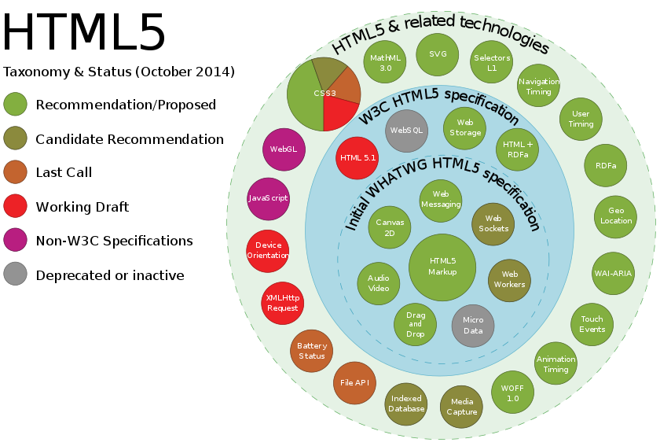

## HTML5新增 API

### 语义化

### 连通性
1. Web Sockets
2. Server-send events
3. WebRTC

### 离线与存储
1. localStorage
2. sessionStorage
3. indexDB
4. 离线存储已废弃 

### 多媒体
1. audio
2. vedio
3. WebRTC
4. Camera API
5. Track和WebVTT
 
### 2D/3D 绘图与效果
1. canvas
2. webGL
3. SVG?

### 性能与集成
1. Web Workers
2. XHR2
3. History API
4. contentEditable
5. 拖放
6. requestAnimationFrame
7. 全屏 API
8. 指针锁定 API
9. 在线和离线事件
10. 基于 Web 的协议处理程序（navigator.registerProtocolHandler() ）

### 设备访问
1. Camera API
2. 触控事件
3. 地理位置
4. 设备方向
5. 指针锁定 API

### 样式设计
