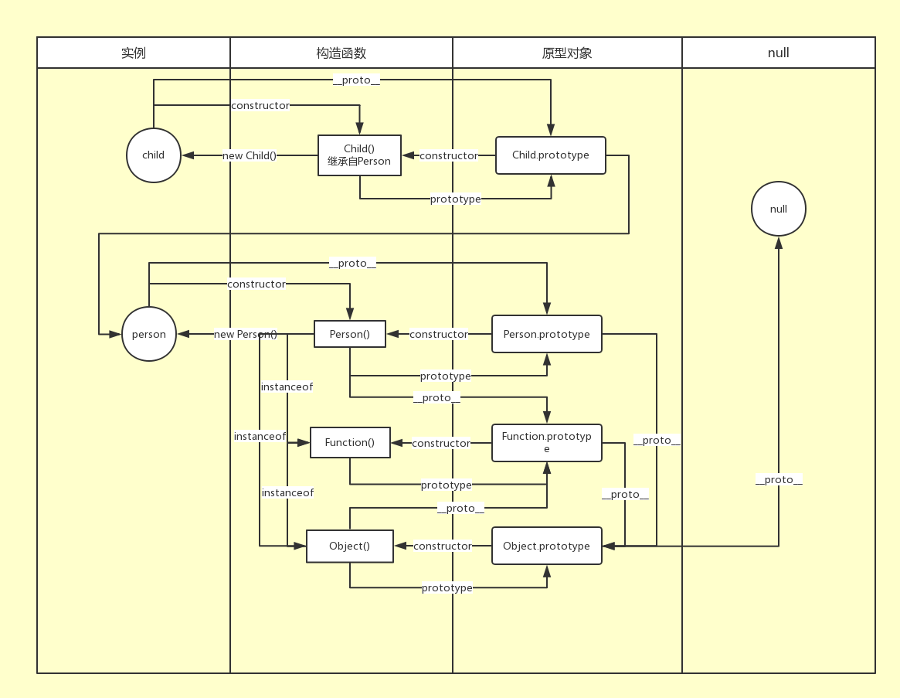

# JS 面向对象
## ES5(参考 JS 高级教程第三版)
### 对象的定义
> 无序属性的集合，其属性可以包含基本值，对象或者函数。

### 对象的相关概念

* 原型：我们每创建的一个函数都有一个 prototype（原型）属性，这个属性是一个指针，指向一个对象，而这个对象的用途是包含可以由特定类型的所有实例共享的属性和方法。
* 原型链：每个构造函数都有一个原型对象，原型对象包含一个指向构造函数的指针```constructor```，而实例都包含一个指向原型对象的内部指针```[[Prorotype]]```。如果让原型对象等于另一个类型的实例，那么这个原型对象将包含一个指向另一个原型的指针，相应地，另一个原型中也包含指向另一个构造函数的指针。假如另一个原型又是另一个类型的实例，那么上述关系依然成立，如此层层递进就构成了实例与原型的链条，也就是原型链。

* 公有方法：可以由实例调用的方法。通常定义在构造函数的原型之上。

* 私有方法：只能在构造函数内部访问的方法，对每new一个实例来说，是不可见的，只在构造函数的执行过程中可见。其this不指向构造函数和实例。

* 静态方法：静态方法调用直接在类上进行，不能在类的实例上调用。静态方法通常用于创建实用程序函数。其this指向构造函数。
* 公有属性,私有属性,静态属性以此类推。
* 特权方法：特权方法，也是公有方法，任何生成的实例都可以调用，但这里之所以称之为特权方法，是因为该方法由于放到了构造函数的内部，使得其具有权限访问构造函数执行过程的作用域链上的各个属性和方法，包括私有属性和私有方法，但同时由于作为实例的一个成员方法，每new一个对象，都会创建一个单独的特权方法的拷贝。所以特权方法的存在是为了访问私有方法和私有属性的公有方法。这里其实已经形成了一个闭包。

eg:

```js
function Person(name) {
    this.name = name;
    // 特权方法
    this.greet = function() {
        _sayHello();
    }
    //私有方法
    function _sayHello() {
        console.log('hello');
    }
}
// 静态方法
Person.quiet = function() {
    console.log('shut up');
}
// 公有方法
Person.prototype.sayName = function() {
    console.log(this.name);
}
```

> 在同一个类中的一个静态方法调用另一个静态方法，你可以使用 this 关键字。
> 
> 静态方法不能直接在非静态方法中使用 this 关键字来访问。你需要使用类名来调用它们：`CLASSNAME.STATIC_METHOD_NAME()` 或者将其作为构造函数的属性来调用该方法： `this.constructor.STATIC_METHOD_NAME()`。

### 对象的相关属性及方法
#### 属性
1. ```prototype```： 构造函数的属性，指向其原型
2. ```__proto__```：实例的属性指向其原型，也是其构造函数的原型。
3. ```constructor```：原型的属性，指向其构造函数。

#### 方法
1. ```instanceof```：判断一个对象是否是某个构造函数的实例。每个对象都是创建它的构造函数及父类构造函数的实例。但是```null```不是任何构造函数的实例。

```js
function Person(name) {
	this.name = name;
	this.sayName = function() {
		console.log(this.name);
	}
}
var p1 = new Person('Crowphy');
console.log(p1 instanceof Person);  //true
// 所有对象都继承自 Object，null除外
console.log(p1 instanceof Object);  //true
console.log(null instanceof Object);  //false
```

2. ```typeof```：判断一个变量的数据类型，无法判断具体的构造函数。
2. ```Object.create()```：
1. ```Object.defineProperty(obj, property, {attributes})```：修改特性。
3. ```Object.defineProperties(obj, {Properties})```：一次性定义多个属性的特性。

4. ```Object.getOwnPropertyDescriptor(obj, property)```：读取相关属性的特性。
5. 


### 对象之间的关系


### 理解对象
##### 属性特性：

描述属性的属性，亦称为特性（attribute），用于描述属性的各种特征

> ES 有两种属性特性：数据属性和访问器属性

##### 1. 数据属性：

* ```[[Configurable]]```：可配置属性。表示能否通过 delete 删除从而重新定义属性，能否修改属性，或者能够把数据属性修改为访问器属性。对于直接定义在对象上的属性，默认为 true。一旦把其更改为 false 便不可再改回来，此时修改除 writable 之外的特性都会报错。
* ```[[Enumerable]]```：可枚举属性。表示能否通过 ```for-in``` 循环遍历属性。对于直接定义在对象上的属性，默认为 true。
* ```[[Writable]]```：可写属性。表示能否修改属性的值。对于直接定义在对象上的属性，默认为 true。
* ```[[Value]]```：值属性。包含此属性的数据值。默认为 undefined。

> 可以通过 ```Object.defineProperty(obj, property, {attributes})```修改特性。

```js
var person = {};
Object.defineProperty(person, "name", {
    writable: false,
    value: "Crowphy"
});
console.log(person.name); //"Crowphy" 
person.name = "Tick"; 
console.log(person.name); //"Crowphy"
```	

##### 2.访问器属性：

* ```[[Configurable]]```：可配置属性。表示能否通过 ```delete``` 删除从而重新定义属性，能否修改属性，或者能够把数据属性修改为访问器属性。对于直接定义在对象上的属性，默认为 true。一旦把其更改为 false 便不可再改回来，此时修改除 writable 之外的特性都会报错。
* ```[[Enumerable]]```：可枚举属性。表示能否通过 ```for-in``` 循环遍历属性。对于直接定义在对象上的属性，默认为 true。
* ```[[Get]]```：读取属性时调用的函数。默认为 ```undefined```
* ```[[Set]]```：写入属性时调用的函数。默认为 ```undefined```

##### Tips
> 访问器属性不能直接定义，必须通过 ```Object.defineProperty()```定义。
> 
> getter和 setter 属性一般需要同时定义。否则，如果只定义 ```getter``` ，则无法写入；只定义 ```setter```，则无法读取。

> ```Object.defineProperties(obj, {Properties})```：一次性定义多个属性的特性。
> 
> ```Object.getOwnPropertyDescriptor(obj, property)```：读取相关属性的特性。

### 创建对象
####  一般情况
一般情况下我们只需要一个空对象，可以通过以下几种方式：

1.

```js
var a = new Object()
```	
2.

```js
var a = {}
```
3.

```js
var a = Object.create(null)
```
	
### 多次创建
> 重点：组合使用构造函数模式和原型模式
#### 工厂模式

```js
function createPerson(name) {
	var o = new Object();
	o.name = name;
	o.sayName = function() {
		console.log(this.name);
	}
	return o;
}
var obj = createPerson('Crowphy');
```
> 缺点：无法知道一个对象的类型，因为都是直接调用```Object```构造函数创建的。

#### 构造函数
```js
function Person(name) {
	this.name = name;
	this.sayName = function() {
		console.log(this.name);
	}
}
var p1 = new Person('Crowphy');
console.log(p1 instanceof Object);  //true
console.log(p1 instanceof Person);  //true
```
创建自定义的构造函数意味着将来可以将它的实例标识为一种特定的类型；而这正是构造函数模式胜过工厂模式的地方。

> 缺点：每个方法都要在每个 实例上重新创建一遍。


使用 new 创建对象实际会经历以下四个阶段：

> 1. 创建一个新对象；
> 2. 将该对象的`__proto__`属性指向构造函数的`prototype`；
> 2. 将构造函数的作用域赋给新对象（将 this 指向该对象）；
> 3. 执行构造函数中的代码（为该对象添加属性）；
> 4. 返回该对象。

new的模拟实现：

```js
/**
 * new的模拟实现
 * 
 * @returns 
 */
function myNew() {

  var obj = Object.create(Object.prototype);
  var ctr = Array.prototype.shift.call(arguments);
  obj.__proto__ = ctr.prototype;
  var result = ctr.apply(obj, arguments);
  return typeof result === 'object' ? result || obj : obj;
}

function Person(name) {
  this.name = name;
}

Person.prototype.sayName = function() {
  console.log(this.name)
}
var p = myNew(Person, 'Cr')
p.sayName() // 'Cr'
```


##### Tips
如果构造函数中 ```return``` 了一个对象，则会覆盖默认返回的对象
#### 原型模式
```js
function Person(){
}
Person.prototype.name = "Crowphy";
Person.prototype.age = 29;
Person.prototype.job = "Software Engineer";
Person.prototype.sayName = function(){
    console.log(this.name);
};
var person1 = new Person();
person1.sayName();   //"Crowphy"
var person2 = new Person();
person2.sayName(); //"Crowphy"
alert(person1.sayName == person2.sayName);  //true
```    
> 缺点：
> 
> 1. 它省略了为构造函数传递初始化参数这一环节，结果所有实例在 默认情况下都将取得相同的属性值。
> 
> 2. 原型中所有属性是被很多实例共享的。

#### 组合使用构造函数模式和原型模式

```js		
function Person(name, age, job){
	this.name = name;
	this.age = age;
	this.job = job;
	this.friends = ["Shelby", "Court"];
}
Person.prototype = {
	constructor : Person,
	sayName : function(){
	    console.log(this.name);
	}
}
var person1 = new Person("Crowphy", 29, "Software Engineer");
var person2 = new Person("Greg", 27, "Doctor");
person1.friends.push("Van");
console.log(person1.friends);    //"Shelby,Count,Van"
console.log(person2.friends);    //"Shelby,Count"
console.log(person1.friends === person2.friends);//false
console.log(person1.sayName === person2.sayName);//true
```
最常用的一种创建自定义类型方法。
#### 动态原型模式

```js
function Person(name, age, job){
    //属性
    this.name = name; 
    this.age = age; 
    this.job = job;
    //方法
    if (typeof this.sayName != "function") {
        Person.prototype.sayName = function(){
            console.log(this.name);
    	}; 
    }
}
```
通过判断方法存在与否以保证每个方法只创建一次。
	
#### 寄生构造函数模式

```js
function Person(name, age, job){
    var o = new Object();
    o.name = name;
    o.age = age;
    o.job = job;
    o.sayName = function(){
        alert(this.name);
    };
	return o; 
}
var friend = new Person("Crowphy", 29, "Software Engineer");
friend.sayName();  //"Crowphy"   
```    
与工厂模式相比，它使用了 ```new```；与构造函数模式相比，它返回一个对象以重新默认返回的对象。
#### 稳妥构造函数模式
所谓稳妥对象，是指没有公共属性，其方法也不使用 this 对象。最适合在一些安全的环境或者防止数据被篡改的情况下使用。

```js
function Person(name, age, job){
    var o = new Object();
    o.sayName = function(){
        alert(name);
    };
	return o; 
}
var friend = Person("Crowphy", 29, "Software Engineer");
friend.sayName();  //"Crowphy"
```
    
相比于寄生构造模式的不同，一不使用 new；二方法中不使用this。

### 继承
继承分为接口继承和实现继承。接口继承只继承方法签名，实现继承则继承实际的方法。ES 只支持实现继承，且其实现继承主要依靠原型链。
> 重点：组合继承和寄生组合式继承

#### 原型链
#### 构造函数
#### 组合继承（伪经典继承）

```js
function Super(name) {
	this.name = name;
}
Super.prototype.sayName = function() {
	console.log(this.name);
}
function Sub(name, age) {
	// 第一次调用父类构造函数
	Super.call(this, name);
	this.age = age;
}
// 第二次调用父类构造函数
Sub.prototype = new Super();
// 将子类原型的构造函数指回Sub
Sub.prototype.constructor = Sub;
```

> 优点：组合继承避免了原型链和借用构造函数的缺陷，融合了它们的优点，成为 JavaScript 中最常用的继承模式。而且，原型链保持不变，```instanceof``` 和 ```isPrototypeOf()```也能够用于识别基于组合继承创建的对象。

>  缺点：1.调用两次父类构造函数；2.包含多余属性（父类构造函数中的）
	
#### 原型式继承
#### 寄生式继承
#### 寄生组合式继承
```js
function inheritPrototype(sub, super) {
	var prototype = Object.create(super.prototype);
	prototype.constructor = sub;
	sub.prototype = prototype;
}
function Super(name) {
	this.name = name;
}
Super.prototype.sayName = function() {
	console.log(this.name);
}
function Sub(name, age) {
	// 第一次调用父类构造函数
	Super.call(this, name);
	this.age = age;
}
// 继承原型
inheritPrototype(Sub, Super);
```
> 优点：1.只调用一次构造函数；2.不包含多余的属性；3.原型链保持不变，可以正常使用```instanceof``` 和 ```isPrototypeOf()```。因此是最理想的继承范式。

## ES6
### Class
