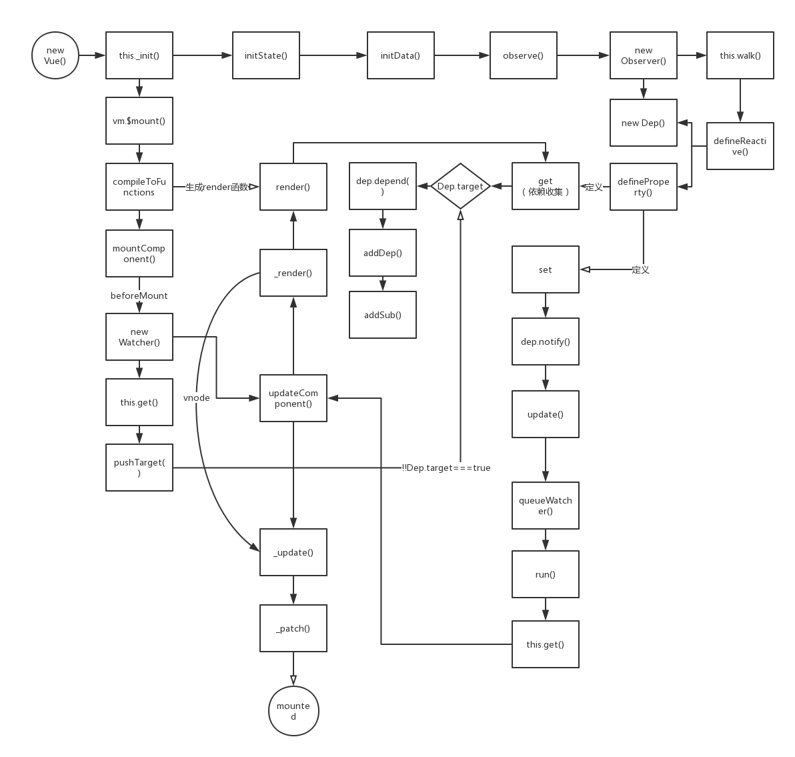

# 双向绑定

先上一张流程图，主要包括在初始化阶段如何建立数据与视图层之间的绑定关系，以及当数据变化时的更新流程两部分。


示例

    <!DOCTYPE html>
        <html lang="en">
          <head>
            <title></title>
            <meta charset="UTF-8">
            <meta name="viewport" content="width=device-width, initial-scale=1">
          </head>
          <body>
            <section class="simple">
              <div class="title">{{ title }}</div>
              <input type="text" v-model="title">
            </section>
            <script src="../dist/vue.js"></script>
            <script>
              var app = new Vue({
                data: {
                  title: 'hello'
                }
                // mounted() {
                //   setTimeout(() => {
                //     this.title = 'abc'
                //   }, 3000)
                // }
              })
              app.$mount('.simple')
            </script>
          </body>
        </html>


上面的代码经过一系列编译会生成为下面的render函数形式：


```js
(function () {
      with (this) {
        return _c('section', {
          staticClass: "simple"
        }, [_c('div', {
          staticClass: "title"
        }, [_v(_s(title))]), _v(" "), _c('input', {
          directives: [{
            name: "model",
            rawName: "v-model",
            value: (title),
            expression: "title"
          }],
          attrs: {
            "type": "text"
          },
          domProps: {
            "value": (title)
          },
          on: {
            "input": function ($event) {
              if ($event.target.composing)
                return;
              title = $event.target.value
            }
          }
        })])
      }
    }
    )
```
在生成的render函数中有引用到了data中的`title`从而触发`Object.defineObject`方法中定义的`getter`，以此收集依赖关系。在`getter`方法中会完成对data中的属性的监听，一旦当其中的属性发生变化就会触发
`Object.defineObject`方法的setter，继而更新视图（中间的更新流程挺长的，看上图，这里就不多说了），由此达到数据到视图层的绑定。

再看render函数的这一段：

```js
on: {
    "input": function ($event) {
        if ($event.target.composing)
            return;
        title = $event.target.value
    }
}
```
通过监听视图层的input事件，当视图发生变化时获取目标值以更新`tltle`，这样便达到了视图层到数据层的绑定的目的。
     

> 更多详细过程后续补充...
